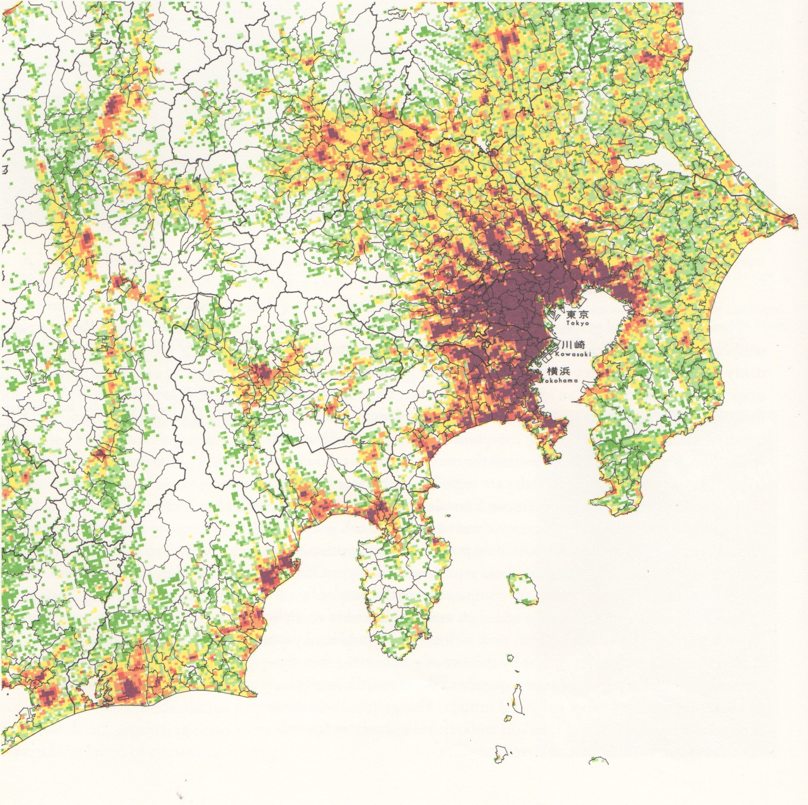
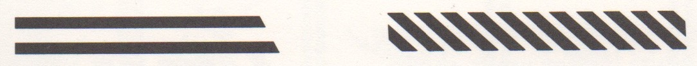

# Edward Tufte _Envisioning Information_

## Einleitung
Edward Tufte stellt in seinem Buch _Envisioning Information_ den Konflikt zwischen den Daten einer lebendigen und sich dynamisch verändernden Welt und ihrer flachen Darstellung auf zweidimensionalen Medien, wie Papier, dar. Er bezeichnet das als _escaping flatlands_.  

Obwohl die Welt in echt dreidimensional ist, wird sie nur zweidimensional, flach dargestellt. Somit stellt sich dem Ersteller einer Grafik die Herausforderung, dass die Kommunikation und Informationsübertragung zwischen ihm und dem Leser seiner Grafik durch diese Zweidimensionalität erfolgen muss. Ziel einer jeden Informationsvisualisierung ist es folglich diesem _flatland_ zu entfliehen. Es gilt Methoden zu finden, die die Informationsdichte auf flachen Oberflächen erhöhen und dabei gleichzeitig die dargestellten Daten klar zu strukturieren. Der Leser muss sich in den Daten zurecht finden. Schlecht gestaltete Darstellungen ermüden den Leser, ermutigen ihn nicht sich mit den dargestellten Zusammenhängen zu beschäftigen und vermindern die Vertrauenswürdigkeit der Datensätze.
Ähnliches gilt für Grafiken, die nur wenige Daten zeigen. 

Grafiken haben jedoch den Vorteil gegenüber anderen Darstellungsformen, dass sie es dem Leser ermöglichen die Daten in einer selbst gewählten Reihenfolge und Geschwindigkeit zu erfassen. Textuelle Informationsübermittlung wertet oft schon die Daten, während gut gestaltete Grafiken es dem Leser selbst überlassen die Daten in einem erkennbaren Kontext einzuordnen. Es sind Mittelwerte, aber auch die eigentliche Variation in den Darstellungen erkennbar. Weiterhin ermöglichen Grafiken einfache Vergleiche, da viele Daten mit einem Blick erfasst werden können.

Das Problem der Darstellung realer Ojekte tritt in verschiedenen Disziplinen auf. Dort sind die Lösungen jedoch oftmals intuitiver. Für dreidimensionale Objekte beispielsweise lassen sich Modelle, wie Architektur-Miniaturen, verwenden. Die Darstellung von häufig abstrakten Datensätzen hingegen ist deutlich komplexer. Solche Datensätze verlieren heute immer mehr ihre Verknüpfung zur realen dreidimensionalen Welt. Nicht selten führt das dazu, dass die Darstellungen nicht gut ihrem eigentlichen Zweck entsprechen. Sie lenken die Aufmerksamkeit zu sehr auf sich selbst, statt auf die eigentlich relevanten Daten. In anderen Fällen sind Darstellungen, wie zum Beispiel Stereobilder, als Informationsvisualisierung ungeeignet, da sie vielen Beobachtern schwer zu begreifen oder zu verwenden sind. Darstellungen sollten daher immer begreifbar und zweckdienlich sein.

Für diese Probleme in der Informationsvisualisierung lassen sich allerdings keine einheitlichen Lösungen finden. Es gibt Muster, die sich in Darstellung verschiedener großer Datensätze wiederholt finden. Diese lassen sich folglich wieder verwenden. Dabei sollte das Design so gut sein, dass es unsichtbar wird. (Daher sind Ornamente prinzipiell unangebracht, um Daten interessanter zu machen.) Die folgenden Kapitel stellen einige dieser Muster vor.

Einige dieser Muster und Methoden finden sich auch in anderen Disziplinen der Grafikgestaltung wieder. Es muss in jeder guten Darstellung auf Typographie, Darstellung, Layout, Farben und weiters geachtet werden. Dabei hat die Informationsvisualisierung jedoch ihre Eigenheiten. Im Gegensatz zur Plakatgestaltung beispielsweise werden deutlich dezentere Schriften und Bilder eingesetzt. Daraus resultiert die gewünschte, deutlich höhere Informationsdichte.

_If the numbers are boring, then you've got the wrong numbers._

## Micro/Macro-Readings
In dem Kapitel Micro/Macro-Readings beschätigt Tufte sich damit wie Zusammenhänge in großen Datensätzen dargestellt werden können. Dabei beschreibt er eine eher unübliche Designstrategie: _to clarify, add detail_

Während Panoramen es dem Leser ermöglichen sich einen Überblick zu verschaffen und globale Strukturen zu erkennen, müssen gelichzeitig Mirko-Informationen Detailinformationen liefern. Eine einfache Lesbarkeit muss durch die Synthese dieser beiden Ebenen geschaffen werden. Einfache Lesbarkeit ergibt sich aus dem Kontext detaillierter und komplexer Informationen. 

Am Beispiel dieser Karte der Bevölkerungsdichte von Tokyo wird dies deutlich. Es handelt sich dabei um eine so genannte _Mesh Map_. Im Gegensatz zu _Chlorpleth Maps_, die sich an geografische oder politische Strukturen halten, sind _Mesh Maps_ in gleichmäßige Rasterquadrate unterteilt. Somit erschließt sich aus der Gesamtheit aller einzelnen Datenpunkte die Gesamtstruktur. Gleichzeitig ist aber möglich die Bevölkerungsdichte einer sehr kleinen Fläche einzeln und im größeren Kontext zu betrachten. Somit trägt jeder einzelne Datenpunkt zu der Gesamtdarstellung bei. 

Das gleiche gilt für das _Vietnam Veterans Memorial_ in Washington. Hier sind die einzelnen Datenpunkte die Namen der gefallenen Soldaten. In einer Micro-Ansicht handelt es sich um Detailansichten. Man kann mit dem Einzelschicksal mitfühlen. Die Gesamtdimension wird erst aus einiger Entfernung sichtbar. Dann fügen sich die einzelnen Namen zu einer großen Menge zusammen und stellen das Gesamtausmaß dar. Auch hier funktioniert jeder einzelne Name als Datenpunkt wieder als Teil der Gesamtdarstellung.   
Dabei sind die Einträge nicht alphapetisch sortiert, sondern nach dem Todestag. Jeder Name liefert also dreierlei Information: Er erinnert an den einzelnen Toten, er trägt einen Punkt zur Gesamtsumme bei und er gibt Aufschluss über den ungefähren Todeszeitpunkt des Soldaten. 
Diese Mehrdimensionalität eines jeden Datenpunktes ist wichtig, um jedem einzelnen Datenpunkt einen geeigneten Kontext zu geben und Vergleiche in verschiedenen Dimensionen zu ermöglichen. Außerdem ist die Anordnung der Daten in einer sinnvollen Reihenfolge ausgesprochen wichtig. Eine alphabetische Anordnung hätte in diesem Fall zu dem Eindruck eines Nachschlagewerkes geführt.

Aus diesen Beispielen lassen sich prinzipielle Methoden ableiten. 
Bei Diagrammen deren primärer Zweck der Vergleich ist, sollten möglichst viele Daten mit einem Blick erfassbar sein. Gleichzeitig muss jeder Datenpunkt multifunktional sein. Er sollte also immer Daten darstellen und zum Gesamtbild beitragen. Dabei übertrifft eine grafische Darstellung immer eine tabulare Form, da mehr Daten erfasst und verglichen werden können.

## Layering and Separation
_Confusion and Clutter are failures of Design, not attributes of information._

Ziel von Visualisierungen ist es also Strukturen, Details und Komplexität der Daten offen zu legen. Eines der stärksten Mittel um das zu erreichen ist die Trennung von Daten durch Ebenen.  
Daten in einer Ebene interagieren zwangsläufig miteinander. Zwei parallele schwarze Linien erzeugen ein drittes weißes Element zwischen sich

 Daraus folgt nach Josef Albers eine Regel, auf die immer bei der Datenvisualisierung geachtet werden muss: _1 + 1 = 3 or more_. Nach dieser Regel hat negativer Raum immer eine eigene Bedeutung. Dieser Effekt trittt vermehrt auf je mehr Objekte zu sehen sind. Der gleiche Effekt tritt auch bei mit engen Boxen umrandeten Texten auf. So schmiegen sich Beschriftungen auch besser von oben als von unten an Formen und Lienien an, da sie mehr Oberlängen als Unterlängen haben.
Ein solches Rauschen in der Darstellung ist meist nicht informativ und seine Bedeutung sollte daher reduziert werden.

Ebenen lassen sich mit verschiedenen Mitteln erzeugen. Gut geeignet sind Farben, Strichstärken und Helligkeiten. So lassen sich beispielsweise Anmerkungen von der eigentlichen Datenmenge abheben. 

Da die Ebenen alleine zwar eine Aussage, aber noch keinen Kontext besitzen, müssen sie harmonisch miteinander verknüpft sein.  
Dies kann man erreichen in dem man den Kontrast in der Darstellung reduziert. So sollte man auf einem weißen Hintergrund Figuren in hellen Farbtönen gestalten oder kein reines weiß als Hintergrundfarbe verwenden.  

Figuren mit scharfen Silouetten können statt in schwarz mit grau gestaltet werden. Außerdem entzieht Grau Hintergrundfiguren Bedeutung und gibt sie farbigen Flächen. Daraus resultiert auch eines der besten Möglichkeiten Informationen hervorzuheben: Kleine Flächen mit saturierten farben betonen relevante Details am besten.  
Darstellungen sollten nie mit Grenzen umrandet werden. Auch in Tabellen sind horizontale Grenzen nur dann nötig, wenn die einzelnen Spalten zu dicht beeinander liegen. Zeilen könnten duch dezente Hintergrundfarben gegeneinander abgehoben werden. Einzig in Nachschlagewerken sind den Daten gleichwertige Abgrenzungen möglich.

Generell gilt also, dass alle Elemente, die keine Informationen enthalten nach Möglichkeit zu entfernen.  
Wird eine Reduktion von Rauschen erreicht, reduziert die Ermüdung beim Leser. Außerdem erhöht eine klare Darstellung die Ablesegenauigkeit.

## Small Multiples
Eine von Tufte verwendete Bezeichnung für ein bestimmtes Prinzip der Informationsvisualierung sind die _small multiples_. Darunter versteht man eine Ansammlung von Bildern, meist sehr klein und schlicht gehalten. _small multiples_ können sehr unterschiedlich verwendet werden.  
Zum einen können verschiedene Zustände gleichrangig und nebeneinander dargestellt werden. Dem Leser eröffnet sich dadurch eine Auswahl an Möglichkeiten und Alternativen. Zum Anderen kann diese Form der Visualisierung dafür verwendet werden, Veränderung eines Objekts über die Zeit oder einen anderen Parameter darzustellen. Gemeinsam haben alle Anwendungen, dass der Fokus der Lesers auf die Unterschiede zwischen den Einzelbildern gelenkt wird.  Wichtig ist dabei vor allem, dass sich zwischen zwei vergleichbaren (gruppierten) Einzelbildern nur ein Parameter ändert, damit der Betrachter den Zusammenhang zwischen den Bildern herstellen kann und sofort den Unterschied zwischen den Sequenzen erkennt.  Eine Komposition von _small multiples_ gibt dem Betrachter die Möglichkeit, Bilder hinsichtlich verschiedener Aspekte zu vergleichen. Dabei können Einzelbilder von _small multiples_ auch selbst bereits mehr als zwei Dimensionen haben.

_small multiples_ sind als Alternative zu einem klassischen Diagramm mit kontinuierlichen Achsen vor allem geeignet, weil man mit ihnen verschiedene Zustände hervorheben kann (zum Beispiel nur Minimum und Maximum darstellen, statt eines Verlaufs) um dem Leser die Essenz der Information auf einen Blick zu vermitteln.  Der Betrachter wird bei _small multiples_ gewzungen, die Sequenzen zu vergleichen.  
Hinzu kommt, dass man durch die Darstellung einzelner Sequenzen die Grafik realitätsnäher halten kann. Objekte müssen nicht mit Variablen kodiert werden, sondern können direkt grafisch dargestellt werden. Damit kann man dem Leser der Kontext einer Datenmenge leichter vermitteln. Auch hinsichtlich der Übersichtlichkeit haben _small multiples_ gegenüber kontinuierlichen Diagrammen einen Vorteil, da die _flatlands_ auf 2 Dimensionen beschränkt sind und durch jede weitere Dimension dem Leser erschwert wird, die dargestellten Daten schnell zu erfassen.
	
Verschiedene Schwierigkeiten sind beim Erstellen von _small multiples_ zu meistern. 
Zunächst ist es wichtig, den Fokus des Lesers auf die dargestellte Information zu lenken. Der gegebene Kontext muss abstrahiert und vereinheitlicht werden, um in den Hintergrund zu treten und nicht vom Unterschied zwischen 2 Sequenzen abzulenken. Darüber hinaus sollte der Hintergrund in Parametern konstant und neutral gehalten sein, die zwischen zwei zu vergleichenden Sequenzen verändert werden. Dabei stellt es eine besondere Herausforderung da, einen Kompromiss zwischen dem Herausheben der Unterschiede durch die Abstraktion der Hintergrunds und dem Verlust von Kontext zu finden.

Ein weiteres Problem stellt die Abgrenzung und Gruppierung der Einzelbilder dar. Dem Leser muss suggeriert werden, welche Sequenzen aufeinander folgen, welche vergleichbar sind und welche sich thematisch zusammenfassen lassen. 
Zur Abgrenzung und Definition der einzelnen Sequenzen eignet sich zum Beispiel ein schmaler Rahmen um jedes Einzelbild. Eine weitere Möglichkeit ist ein Hintergrund, der sich von der Fläche auf der die Komposition an Sequenzen präsentiert wird, abhebt, um den Abstand zwischen den Einzelbildern deutlich zu machen.   
Zusätzlich zu dieser Abgrenzung müssen die Sequenzen entsprechend ihrer thematischen Zusammengehörigkeit. Werden nur zwei Parameter verändert, werden die Bilder anhand dieser Parameter in einer Tabelle angeordnet. Sind diese Abhängigkeiten nicht linear, sondern ordnen sich zum Beispiel sternförmig um einen Mittelwert an, so kann man auch diese Form verwenden und dann immer wiederholen. Zur Unterstützung kann man Farbakzente setzen oder die Bilder anders zugehörig markieren. Oberste Priorität sollte dabei immer haben, den Leser durch das Raster oder Hilfslinien nicht abzulenken.

## Farbe und Information

Farbe ist ein besonders wichtiges Mittel zur Informationsvisualisierung, die menschliche Wahrnehmung ist stark darauf ausgerichtet. Der Mensch kann viele verschiedene Farben erkennen, unterscheiden und mit anderen Sinneseindrücken oder Objekten verknüpfen.  
Gerade deswegen stellt sich der Umgang mit Farbe in der Informationsvisualisierung als schwierig heraus. Der  Betrachter wird von massiven Farbeinsatz schnell überreizt. Dazu kommt, dass es bereits Mechanismen zur Interpretation von Farbe gibt, die beim Menschen fest verankert sind. Diese geben der Visualisierung bestimmte Richtlinien vor, die es zu beachten gilt.

Regeln, die es bei der Verwendung von Farbe zu beachten gilt, hat zum Beispiel Eduard Inhof aufgestellt. 
Er legt besonderes Augenmerk auf Richtlinien zur Verwendung von kräftigen Farben. Farben, die hinsichtlich Sättigung Extreme darstellen, sollten auch in den _flatlands_ Extreme darstellen. Dies begünstigt auch, dass solche satten Farben nur in Maßen und in kleinen Flächen verwendet werden, da Extreme meist keine große Ausbreitung haben. 
Weiterhin hat Inhof festgestellt, dass weißer Text auf satten Farben besonders grell und überladen wird. 
Generell ist eine bekannte Strategie bei der Festlegung der in einer Grafik verwendeten Farbpalette die Anlehnung an die Natur. Dies bezieht sich insbesondere auf Hintergrundfarben und Farben denen Werte mit geringerer Bedeutung zugewiesen werden sollten.
Als optimale Hintergrundfarbe legte er ein helles Grau fest. Dieses grenzt die Grafik zwar leicht gegen den meist weißen Umgebungseraum ab, ohne einen Rahmen zu setzen, ist aber neutral und vereinnahmt die Aufmerksamkeit des Betrachters nicht.

Unter Beachtung dieser Regeln gibt es vier Kategorien, in denen man Farbe als Mittel der Informationsvisualisierung einsetzen kann.
Zunächst als Beschriftung (_to label_ ).  Verschiedene Farben können als Abgrenzung zwischen verschiedenen Werten dienen und Werte eindeutig einer Datenmenge zuordnen. Beispiele dafür findet man in vielen Karten bei der Abgrenzung der Geländetypen.  
Zweitens als Skala für die dargestellten Daten (_to measure_ ). Der Datenwert an einer bestimmten Stelle kann durch die Farbintensität dargestellt werden. Möglich ist auch, die Werte durch eine Farbskala nicht nur im Sinne der Sättigung sondern auch des tatsächlichen Farbtons darzustellen, wie zum Beispiel auf Bildern einer Wärmekamera.   
Gleiche Farben auf unterschiedlichen Hintergründen können aber sehr unterschiedlich wirken und so wird der Datenwert durch die Interpretiation verfälscht wird. Genauso können auch unterschiedliche Farben in ausgleichenden Hintergründen fast gleich aussehen.
Selten kann man sich das wiederum auch zu Nutze machen, wenn die Möglichkeiten der Farbnutzung begrenzt sind, zum Beispiel bei einem Druck in wenigen Farben. Hier kann die Illusion einer weiteren Farbe durch Umrandung oder Vermischung der zur Verfügung stehenden Farben generiert werden. 
Drittens als Repräsentation der Realität. Mit realen Farben kann der Kontext einer Grafik verdeutlicht werden und hilft damit dem Leser bei der Einordnung.  Farbe ist dazu auch ein wichtiges MIttel um Grafiken ansprechend und lebendig zu gestalten, ohne von der eigentlichen Information abzulenken.   
Dazu stellt sich die Frage, ob sich die durch mehrere Komponenten definierte Farbe sogar nutzen lässt, um mehrere Dimensionen gleichzeitig darzustellen. Eine Grafik könnte dann bis zu 5 variable Parameter haben, ohne das _flatland_ zu verlassen. Dies ist allerdings für das menschliche Auge eine eher unintuitive Art der Kodierung. 

Über all diesen Regeln steht weiterhin der Grundsatz von Klarheit, Einfachheit und Eindeutigkeit. Ist die Grafik auch ohne Farbe eindeutig, so muss diese nicht flächendeckend verwendet werden. Mitunter ist auch eine einfacher Kontur bereits ausreichend, um das zu verdeutlichen, was mit Farbe das Auge überreizen könnte.

## Zeit und Raum

Tufte zeigt in diesem Kapitel die Grenzen der Informationsvisualisierung auf. In den folgenden Beispielen werden Kompromisse und Lösungsansätze für besonders schwer in _flatland_ zu konvertierende Sachverhalte aufgezeigt.

Bahnen in mehrdimensionalen Räumen, kombiniert mit zeitlichen Veränderungen, stellen wohl die größte Herausforderung in der Informationsvisualisierung dar. Dennoch haben sich bereits viele Menschen daran gewagt, denn zum Beispiel astronomische Zusammenhänge, Schritte auf einer Tanzfläche oder besonders alltäglich: Fahrpläne, bergen dieses Problem der Veränderung von Raum und Zeit mit Überlagerungen und Überschneidungen.
Die größte Schwierigkeit besteht in diesen Fällen darin, dass man die Zeit nicht einfach auf eine Achse auftragen kann und das sich verschiedene Objekte gleichzeitig mit verschiedenen Geschwindigkeiten bewegen. Auch Rotationen sind ein Problem, für dass es sehr verschiedene 
Für das Beispiel der Planetenbewegung in unserem Sonnensystem gibt den folgenden Lösungsansatz. Anstelle eines dreidimensionalen Raums wird der Raum auf eine einzige Dimension heruntergebrochen. Auf der anderen Achse wurde ausgehend von immer höher frequenten Einzelzuständen erst in Tabellenform, dann kontinuierlich die Zeit aufgetragen. Dreidimensionale Zusammenhänge können an der Grafik nicht abgelesen werden. So wurde ein Kompromiss zwischen Komplexität der übermittelten Daten und Übersichtlichkeit geschaffen.  

Ebenfalls schwierig ist der Umgang mit begrenztem Platz. Dürfen Grafiken nur eine bestimmte Größe haben, gibt es verschiedene Strategien damit umzugehen. Balkendiagramme können umgeschlagen werden und die Peaks von Kurven können ähnlich eines Oktavensprungs in der Musik im unteren Bereich des Diagramms weitergeführt werden. In jedem Fall werden dabei aber massive Abstriche an der Vergleichbarkeit der Werte gemacht.

## Quellenverzeichnis
TUFTE, EDWARD (Herausgeber) (1990): Envisioning Information. Chershire, Connecticut : Graphics Press
